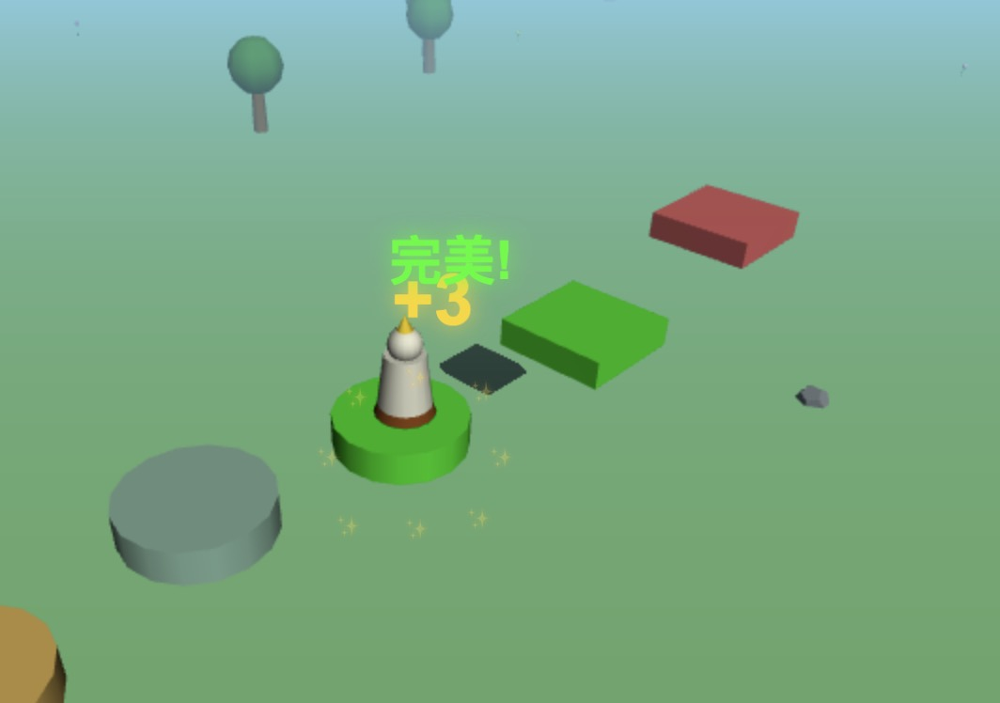

# 3D跳一跳游戏

你是否曾经怀念微信当年让人又爱又恨的“跳一跳”小游戏？现在AI编程轻松复现了它的部分效果。

我真的非常兴奋能够使用 智谱AI最新的旗舰模型 GLM-4.5 驱动 Claude Code 来 Vibe Coding 这个3D跳一跳游戏！

GLM-4.5 的代码生成能力令人印象深刻！几乎达到了 Claude 4 Sonnet 的水准！

从游戏架构设计到具体的3D渲染实现，GLM-4.5 都展现了强大的编程能力和逻辑思维！

这是一个使用 Three.js 开发的3D跳一跳游戏，采用点击蓄力跳跃的玩法。

## 🎮 在线体验

[点击这里](https://cwb660.github.io/3d-jump-game/) 在线体验

## 🎮 游戏玩法

1. **蓄力跳跃** - 按住鼠标左键或空格键蓄力
2. **控制力度** - 观察底部蓄力条，控制跳跃距离
3. **目标得分** - 成功跳到方块上获得分数
4. **避免掉落** - 不要掉落到地面，否则游戏结束

## 🚀 运行方法

1. 下载或克隆项目文件
2. 在浏览器中打开 `index.html` 文件
3. 开始游戏！

## 📝 开发心得

使用 GLM-4.5 进行游戏开发是一次非常棒的体验！模型能够：
- 理解复杂的3D图形概念
- 编写高质量的游戏逻辑代码
- 提供清晰的代码结构
- 快速实现视觉效果